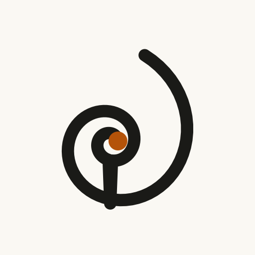

# Brand Proposal: Name + Logo (P0.1 / P2.1 input)

**Status:** Proposal — owner picks a name, then P0.2 rename sweep executes atomically.
**Date:** 2026-09-10

## 1. Name recommendation: **Commonplace**

> **Commonplace** — *a commonplace book that remembers with you.*

A *commonplace book* is exactly what this product is: a reader's personal collection of
ideas, quotes, terms, and notes — kept for life. Your audience (people reading Paul Graham,
Munger, Naval) already knows and loves the word. Positioning writes itself: *"Everyone told
you to keep a commonplace book. This one quizzes you until it sticks."*

### Why it wins

| Check | Result |
|-------|--------|
| App-store collisions | **None found.** No dominant app owns the name; searches surface only the *concept* (Reddit threads asking for a digital commonplace book — i.e. unmet demand). |
| Trademark risk | **Low.** Dictionary word, no famous software mark; low risk of being blocked. (Still: run a proper clearance search before filing anything.) |
| Meaning fit | **Perfect.** Nodes + glossary + scratchpad + quotes = a commonplace book with a memory engine. |
| Spellable / radio test | **Yes.** Common word, one obvious spelling. |
| Length | 11 chars — fine (Play title limit 30). |
| Taglines | "Collect ideas. Keep them." / "A commonplace book that remembers with you." / "Read it once. Keep it forever." |

### Rejected / backup names

| Name | Verdict | Reason |
|------|---------|--------|
| **Trellis** | Backup #1 | Pretty metaphor (train ideas like vines) but **noisy**: "Trellis Personality" already on Play, Trellis Inc (agri) on App Store; gardening connotation confuses. |
| **Lattice** | Backup #2 | Prettiest conceptual fit (your brief's "latticework") but **real trademark risk**: Lattice (HR unicorn, lattice.com) owns the word in software. Only with clearance. |
| Memor / Zettel | Rejected | "Memorize" (AI flashcards) already on Play — confusingly close to Memor. Zettel is insider-only (says nothing about memory to normal users). |
| Recall / Weave / Loom | Rejected | Microsoft Recall, Weave (NYSE: WEAV), Loom — all hard collisions. |

**Domain guidance (D2):** try `commonplace.app` first, then `getcommonplace.com`, `commonplacebooks.com`. Package name later: `app.commonplace.*` / `com.<owner>.commonplace`.

## 2. Logo concepts

Design constraints held for all three: works at 48px launcher size, centered inside the
Android maskable safe zone (~66% center circle), keeps the existing brand tokens
(paper `#faf8f3` / ink `#1a1a17` / accent `#b45309`), full-bleed opaque background.

| # | Concept | File | Idea |
|---|---------|------|------|
| 1 | **Marginalia** ⭐ recommended | `assets/brand/concept-1-marginalia.svg` | A bold asterisk — the sidenote mark. Means *annotation*, the soul of a commonplace book. Instantly legible at any size; one accent arm for brand pop. |
| 2 | C-Thread | `assets/brand/concept-2-c-thread.svg` | The initial **C** drawn as one continuous thread, closed by the brand dot. Modern, minimal, ties to the "thread" language already in the app ("follow the thread"). |
| 3 | Continuity | `assets/brand/concept-3-continuity.svg` | The current spiral, rebalanced and padded for the maskable safe zone. Lowest-risk evolution if you love the existing mark. |

Preview sheet: `assets/brand/preview-sheet.png` (left → right: 1, 2, 3).

**Recommendation:** Concept 1. It survives 48px (asterisks are chunky by nature), it's
ownable in a sea of book/gradient icons, and the story ("every idea here earns its asterisk")
is pitchable. Concept 2 is the safe-modern fallback.

## 3. What happens after you pick

1. **P0.2 rename sweep** (one atomic commit): `APP_NAME` in `src/lib/site.ts`, manifest
   `name`/`short_name`, all `— Unknown` titles, onboarding copy, `album: "Unknown"`,
   SW comment, `SITE_URL` fallback (`unknown.love`), sitemap regen. Content files
   (`cluster-*.ts`) are **excluded** — "unknown" there is ordinary prose (2 hits verified).
2. **P2.1 icon production**: winning mark → `icon-192/512` + opaque `icon-maskable-512`
   + `apple-touch-icon` (180px) + `favicon.ico`, validated against the safe-zone overlay.
3. Manifest `screenshots` + store graphics (P9.1) follow the same system.

### Rename inventory (files touching "Unknown" as brand, verified 2026-09-10)

`src/lib/site.ts`, `src/routes/__root.tsx`, `index.tsx`, `explore.tsx`, `skim.tsx`,
`review.tsx`, `you.tsx`, `onboarding.tsx`, `node.$id.tsx`, `read.$id.tsx`,
`src/components/AudioBar.tsx`, `src/components/InstallAppButton.tsx`,
`public/manifest.webmanifest`, `public/sw.js`, `scripts/generate-sitemap.ts`,
`package.json` (`name`), `docs/*` (roundup pass).
